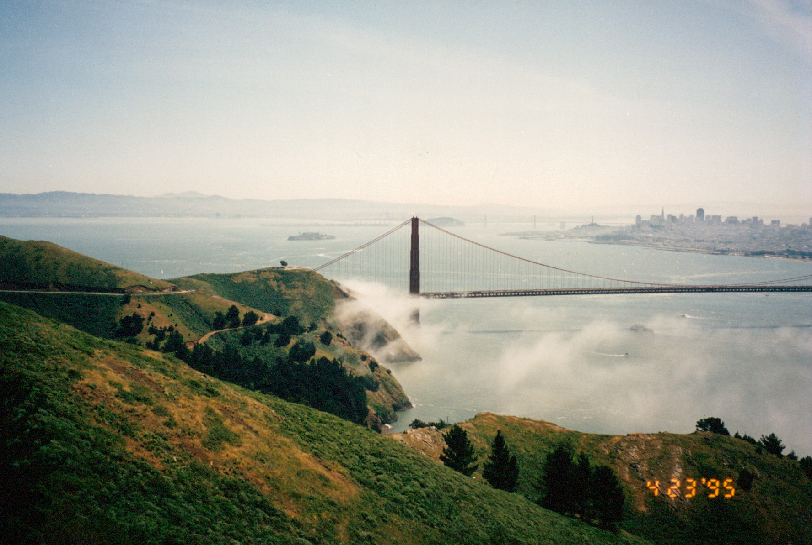

# Photo Date Inputter

Several years ago, I underwent the process of digitizing my family's photos (largely 3x5 inches, however some negatives were scanned as well). While it is great that this data is now saved (and backed up several times over), it is not browsable in any meaningful sense (by date, by person, location, etc). I've started first to identify dates and faces. 

## Previous Attempts
I have tried several attempts to automate this, including machine learning, threshold detection to extract a photo's date that is printed on the photo (see below), but have not achieved reliability to any significance sense. There are several difficulties including that some photos don't have a date, some dates are smudged, some dates are clipped, sometimes the date is written MM-DD-YYYY an other times DD-MM-YYYY (which can be very confusing if both DD and MM < 12), etc.

## This Project
As a result, I wrote a simple web app that queues all photos and displays them, with keyboard shortcuts for each person in the photo and for entering the date.